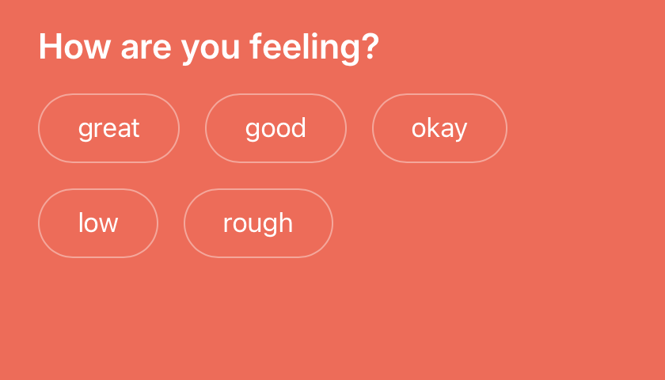
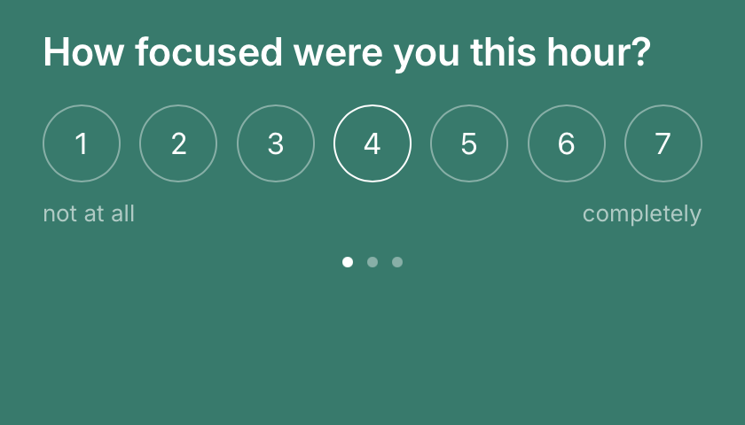

<p align="center">
  
</p>

# cenno

**cenno is a macOS app that lets AI agents ask you questions through minimal floating panels — and get your answer back as structured data.**

If you run MCP-capable agents (Claude Code, Claude Desktop, or anything that speaks the [Model Context Protocol](https://modelcontextprotocol.io)), cenno gives them a polite way to reach you: a small panel slides over whatever you're doing — without stealing your keyboard focus — you tap or type, and the agent receives `{answer, via, elapsed_s}` as the tool result. Every exchange is recorded locally, so your answers become your own queryable dataset.

Built for time-sensitive, low-friction interactions: mood check-ins, EMA questionnaires, quick decisions, reminders.

<p align="center">
  
  
</p>
<p align="center"><em>Actual panels: a mood check-in and a multi-step EMA scale. One question per screen, full-bleed color per flow, quiet <code>cenno</code> wordmark and dismiss ✕ — nothing else.</em></p>

> *Fare un cenno* — Italian: to give a small sign. To nod (*mi ha fatto un cenno*), to mention briefly (*ha fatto un cenno al problema*), to beckon silently (*mi ha fatto cenno di entrare*). That's the whole interaction model: agents make a small sign, you answer with one.

---

## Install

**[Download the latest DMG](https://github.com/glebis/cenno/releases/latest)** (signed & notarized, Apple Silicon, macOS 12+), drag cenno to Applications. Or via Homebrew:

```bash
brew install --cask glebis/tap/cenno
```

On first launch cenno lives in your menu bar, registers itself to launch at login (you can turn that off in the tray menu), and waits for prompts.

<details>
<summary>Build from source</summary>

Requirements: Rust stable, Node 20+, Xcode Command Line Tools.

```bash
npm install
npx tauri build --no-bundle          # unsigned dev binary → src-tauri/target/release/cenno

# Signed, installable .app + .dmg (your own Developer ID):
APPLE_SIGNING_IDENTITY="Developer ID Application: Your Name (TEAMID)" npx tauri build
```

Note for contributors: a plain `cargo build` binary loads the Vite dev server (port 1430) and shows a blank page unless `npm run dev` is running. CSP is only enforced in bundled builds — test security changes against `npx tauri build` output, never `tauri dev`.
</details>

## Quickstart (60 seconds)

1. Install cenno (above).
2. Add it to any project's `.mcp.json`:

```json
{
  "mcpServers": {
    "cenno": {
      "command": "/Applications/cenno.app/Contents/MacOS/cenno",
      "args": ["--mcp-stdio"]
    }
  }
}
```

3. Your agent now has an `ask_user` tool. Or try it from the shell:

```bash
/Applications/cenno.app/Contents/MacOS/cenno ask "Ship it?" --timeout 30
```

A panel appears; your answer prints as JSON. cenno auto-launches if it isn't running.

## Agent skill

Want your agent to ask *well* — pick the right input kind, sensible flows, graceful timeouts — and to wire cenno into a project itself? Install the ready-made [`cenno` skill](skills/cenno). It bundles `ask_user` usage, custom 1–N scales, etiquette, and a setup mode.

**Install via [`npx skills`](https://github.com/vercel-labs/skills):**

```bash
npx skills add https://github.com/glebis/cenno/tree/main/skills/cenno
```

**Or just ask your agent (install via prompt):**

> Install the cenno agent skill from https://github.com/glebis/cenno/tree/main/skills/cenno — copy it into my Claude skills directory.

Once installed it activates on its own whenever a task calls for asking the user, running a check-in, or setting cenno up.

## Why not just a terminal prompt or a dialog box?

- **Focus-preserving**: the panel is a non-activating macOS panel — it floats above your work but never grabs your keyboard. You answer when you glance at it, not when it interrupts you.
- **Structured answers**: agents get typed results (text / choice / scale / confirm), not parsed strings.
- **Respectful by policy**: pause it from the tray (15 min → until tomorrow), and it stays quiet automatically while the screen it lives on is in fullscreen. Suppressed prompts queue and replay; agents just see their normal timeout.
- **Your data stays yours**: every outcome lands in a local SQLite file (`0600` permissions, never leaves the machine) and exports as JSON/CSV.

---

## The `ask_user` tool

| Param | Type | Notes |
|---|---|---|
| `title` | string | the question |
| `body_md` | string | optional markdown body |
| `input.kind` | `text` · `voice_text` · `choice` · `scale` · `confirm` · `none` | answer control |
| `choices` | string[] | for `choice` |
| `flow` | `mood` · `question` · `ema` · `reminder` · `ambient` | panel color theme |
| `progress` | `{step, total}` | dot pagination for multi-step flows |
| `timeout_s` | number | default 120 |
| `a2ui` | array | optional rich layout ([A2UI](https://a2ui.org) v0.9 messages, validated at the boundary; see [docs/design/TOKENS.md](docs/design/TOKENS.md)) |

Returns `{answer, via, elapsed_s}`, or `{answered: false, prompt_id}` on timeout.

### `ask_sequence`

Run several questions in one panel, advancing instantly between them — `ask_sequence({questions: [<ask_user args>…], flow?})` returns an ordered `answers` array. Progress dots auto-fill; a per-question timeout ends the run early (the `answers` array is as long as the user got). See the [`cenno` skill](skills/cenno) for a worked 3-question example.

## CLI

```bash
cenno ask "Question" --body "Optional markdown" --timeout 30
# exit codes: 0 answered · 2 timed out · 1 not running/error

cenno --tray          # run headless (menu bar only)
cenno --mcp-stdio     # MCP bridge; auto-launches the app if needed

cenno export                    # full history as JSON
cenno export --format csv
cenno export --since 2026-06-01
```

## History

Every prompt outcome — answered or timed out — is recorded in
`~/Library/Application Support/app.cenno/cenno.db`: question, input kind, flow, status, answer, how it was answered, response time, timestamps. `cenno export` dumps it; an empty history exports as `[]`.

**Privacy:** all data is local; cenno makes no network connections on its own. The one exception is explicitly user-initiated: **Check for updates…** in the tray menu contacts GitHub releases (and downloads the update if you confirm). Answers are stored in plaintext inside your user-only (`0600`) database — FileVault covers it at rest.

## Tray menu

```
Pause for ▸  15 min · 30 min · 1 h · 2 h · 5 h · 8 h · Until tomorrow
Resume now
──────────────
Don't show in fullscreen   ✓ (default on)
Launch at login            ✓ (default on)
──────────────
Check for updates…
Quit cenno
```

- **Until tomorrow** = the next 5:00 AM, so a late-night pause survives the midnight boundary.
- **Fullscreen quiet mode** only considers the screen the panel lives on; a fullscreen app on another display doesn't silence prompts. Suppressed prompts reappear on resume, toggle, pause expiry, or the next prompt.
- Pause and quiet mode never break the agent contract — unseen prompts simply time out as usual.
- **Check for updates…** queries GitHub releases (signature-verified via [the Tauri updater](https://v2.tauri.app/plugin/updater/)), and installs + restarts only after you confirm. A restart drops any on-screen prompt — its agent sees a normal timeout.

## Roadmap

- **EMA scheduling engine** — recurring check-ins defined in cenno itself
- **Voice input** — local whisper.cpp dictation with optional BYOK (Groq/OpenAI)
- **Tray inbox** — answer prompts you missed

## Development

```bash
npm run dev & npm run tauri dev     # live frontend + app
cargo test            # Rust (run in src-tauri/)
npx vitest run        # frontend
npm run tokens        # rebuild CSS from tokens/tokens.json (W3C DTCG, validated)
./scripts/demo.sh all # fire one demo prompt of each kind
```

### Releasing an update

In-app updates flow from GitHub releases. To ship one:

1. Bump `version` in `src-tauri/tauri.conf.json` (and `package.json`).
2. Build with the updater signing key (generated via `tauri signer generate`;
   the matching pubkey is committed in `tauri.conf.json`):

   ```bash
   TAURI_SIGNING_PRIVATE_KEY_PATH=~/.tauri/cenno.key \
   APPLE_SIGNING_IDENTITY="Developer ID Application: …" npx tauri build
   ```

   `createUpdaterArtifacts` makes this emit `cenno.app.tar.gz` + `cenno.app.tar.gz.sig`
   next to the DMG.
3. Create the GitHub release with the DMG, the `.tar.gz`, the `.sig`, and a
   `latest.json` pointing at the `.tar.gz` ([format](https://v2.tauri.app/plugin/updater/#static-json-file)):

   ```json
   {
     "version": "0.2.0",
     "pub_date": "2026-06-15T12:00:00Z",
     "platforms": {
       "darwin-aarch64": {
         "signature": "<contents of cenno.app.tar.gz.sig>",
         "url": "https://github.com/glebis/cenno/releases/download/v0.2.0/cenno.app.tar.gz"
       }
     }
   }
   ```

Installed apps find it at `releases/latest/download/latest.json`. Lose the
private key and shipped apps can never update again — back it up.

Design system: [docs/design/TOKENS.md](docs/design/TOKENS.md) (palette, type, components) and [docs/design/BRAND.md](docs/design/BRAND.md) (the mark). The complete spec → plan → review trail this app was built from is in [docs/superpowers/](docs/superpowers/) — cenno was built end-to-end by AI agents, reviews included, in two days.

## License

[Apache-2.0](LICENSE) © Gleb Kalinin. See [NOTICE](NOTICE) and
[AUTHORSHIP.md](AUTHORSHIP.md) for the authorship record, and
[SECURITY.md](SECURITY.md) for the threat model and how to report
vulnerabilities.
